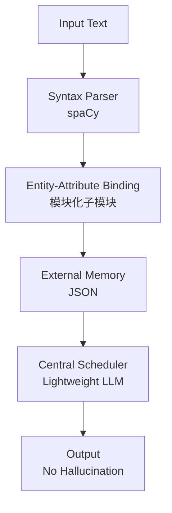

# Brain-Inspired Decoupled LLM: Minimal MVP | Solve Bloat, Black-Box, Amnesia & Hallucination
# 类脑解耦大模型 最简MVP | 从根源解决LLM臃肿、黑箱、失忆、幻觉四大核心问题

## Design Philosophy: This Implementation Is a "Concept Sketch"

This project demonstrates an **architectural idea**: decomposing natural language understanding into two paths — **cognition** (learning / memorizing) and **question answering** (retrieving / reasoning). Each path is handled by dedicated, independent modules, and finally a lightweight LLM serves only as the **language interface** that verbalizes facts stored in a temporary memory space.

To quickly validate this data flow in a Minimum Viable Product (MVP), we deliberately used simplified technical placeholders:

- `spaCy` rule matching **temporarily stands for** a future intent classifier or information extraction model.
- A `JSON` file **temporarily stands for** the actual persistent memory store (e.g., a knowledge graph, vector database, or relational DB).
- Hard‑coded branching logic **temporarily stands for** dynamically dispatched expert sub‑modules.

**These placeholders are not the upper bound of the architecture.** They are merely a “concept sketch” for easy demonstration. Our true goal is that each abstraction layer can be replaced by properly trained specialist models (e.g., a fine‑tuned BERT for entity extraction, a graph database for knowledge storage, a symbolic solver for arithmetic), while the core principles remain unchanged:

- External memory is the **single source of truth**.
- The LLM **only repeats** what resides in the temporary memory space — no factual generation, no hallucination.

So please do not judge the architecture by how “primitive” the current code looks. Instead, focus on the possibility this architecture points to: **a decoupled, specialized, and fully auditable AI system where hallucinations are eliminated by design.**


## 🧠 Architecture Flowchart


## 🌟 Project Overview
A **minimal, reproducible prototype** for a brain-inspired modular decoupled LLM architecture. Rejecting Transformer's "parameter brute-force stacking" paradigm, this project verifies a new AI design philosophy:  
- Syntax-driven entity-attribute binding (core of brain-inspired logic)  
- Specialized sub-modules for fact extraction (no more parameter entanglement)  
- External structured memory (JSON/DB/Vector DB compatible)  
- Lightweight LLM as central scheduler (no hallucination, only logic integration)  
- Full white-box workflow (interpretable, maintainable, edge-deployable)  

## 🎯 Core Values (Solve 4 LLM Fatal Flaws)
| LLM Traditional Flaw | Solution & Advantage |
|-----------------------|----------------------|
| Model Bloat (臃肿)    | Modular split → Run on mobile/edge devices (low computation cost) |
| Black-box Opacity (黑箱) | End-to-end white-box → Trace every decision to memory/sub-module |
| Context Amnesia (失忆) | External persistent memory → Unlimited long-term storage |
| Generation Hallucination (幻觉) | Fact-locked sub-modules → LLM only integrates, no fabrication |

## 🛠️ Dependencies & Environment
- OS: Windows 10+/macOS/Linux
- Python 3.8+
- Required Libraries: `spacy`
- AI Framework: OpenClaw
- Scheduler LLM: Gemma-4-31B (or any 7B+ lightweight LLM)
- Syntax Parser: spaCy `en_core_web_sm`

## 🚀 Quick Start (1-Minute Setup)
```bash
# 1. Install dependencies
pip install spacy
python -m spacy download en_core_web_sm

# 2. Clone this repo
git clone https://github.com/your-username/BrainDecoupledLLM-MVP.git
cd BrainDecoupledLLM-MVP

# 3. Run MVP extraction script (replace "xxxxx" with your test text)
python mvp_extraction.py

# 4. Check memory output (memory.json) & test with your LLM scheduler
```

## 📊 Test Case & Result
### Input Text
`A red circle and a blue square.`

### Output Structured Memory (memory.json)
```json
{
    "circle": {"attribute": "red"},
    "square": {"attribute": "blue"}
}
```

### LLM Query Verification
- Question: "Is the circle green?"
- Response (from Gemma-4-31B): "No, the circle is not green. According to the memory record, the circle is red."  
(100% fact-based, no hallucination)

## 🧠 Architecture Philosophy
1. **Decoupled Responsibility**: Syntax → Parser; Facts → Sub-modules; Memory → External Storage; Logic → Scheduler; Generation → LLM.  
2. **Modular Flexibility**: Plug-and-play sub-modules (parallel/serial scheduling supported).  
3. **Storage Agnosticism**: JSON/DB/Vector DB are interchangeable (essentially data I/O + retrieval).  
4. **Ultimate Goal**: Enable everyone to run a **private, controllable, evolvable Personal AI on mobile phones**.

## 📈 Roadmap
- [ ] Expand sub-modules: Math Calculator, Association Reasoning, Imagination Generator  
- [ ] Mobile/Edge adaptation (Android/iOS NPU optimization)  
- [ ] Build modular ecosystem (standardized plugin interface)  
- [ ] Support Chinese syntax parsing & multilingual extension  

## 📚 Full Documentation & Deep Dive
- CSDN (Chinese): https://blog.csdn.net/qq_45133545/article/details/160489034?fromshare=blogdetail&sharetype=blogdetail&sharerId=160489034&sharerefer=PC&sharesource=qq_45133545&sharefrom=from_link
- DEV.to (English): https://dev.to/carlow7922/brain-inspired-decoupled-llm-minimal-mvp-launch-fixing-4-core-flaws-bloat-black-box-amnesia-3o4c

## 🔖 Topics
`llm` `ai-architecture` `brain-inspired-ai` `modular-ai` `decoupled-llm` `no-hallucination-ai` `edge-ai` `personal-ai` `white-box-ai` `openclaw` `spacy`

---
**License**: MIT  
**Author**: Carlow  
**Star ⭐ this repo if you find it valuable!**
